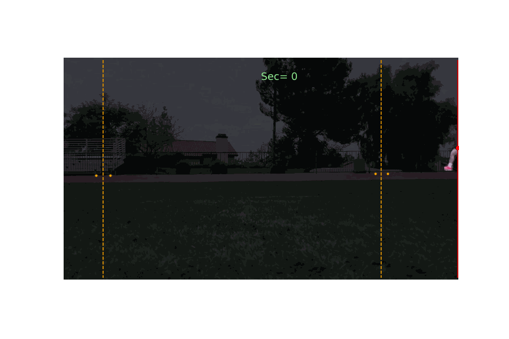
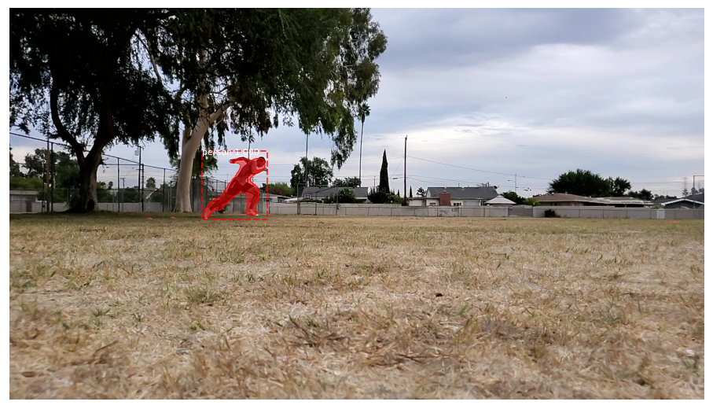
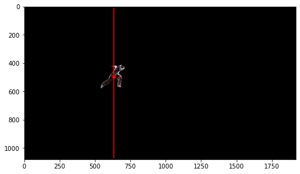
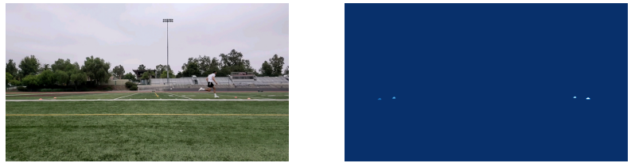
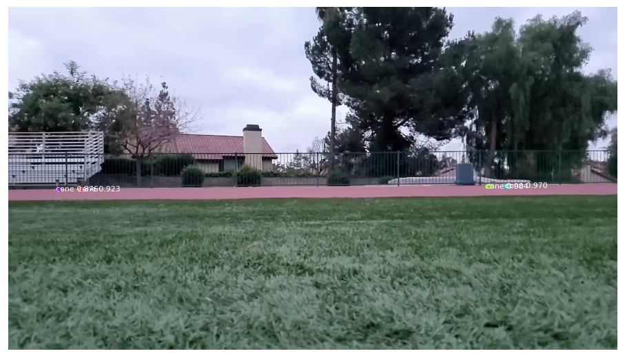
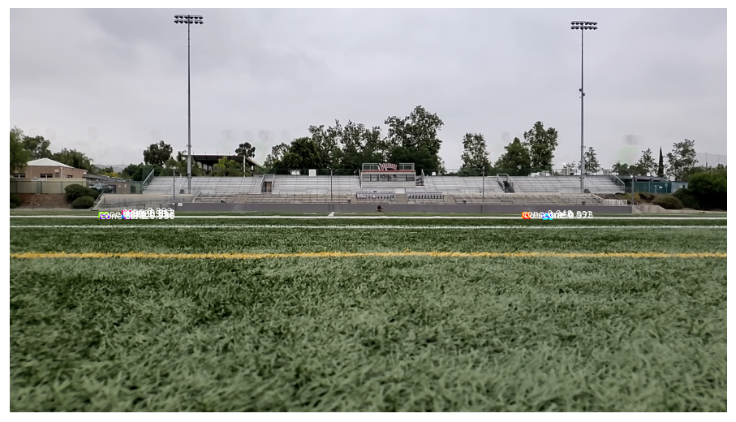
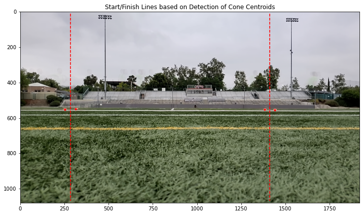
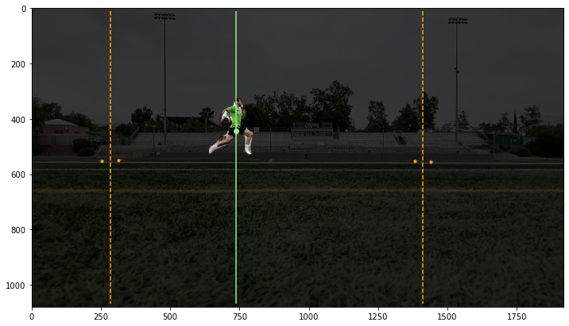
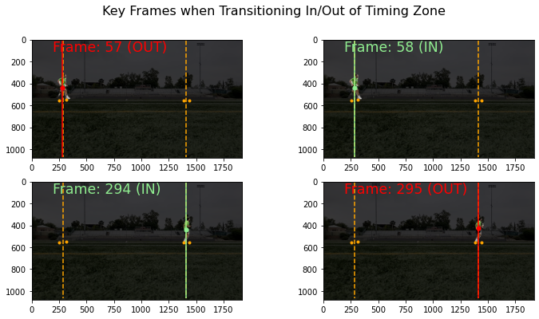

# Timing Sprints with Mask R-CNN Instance Segmentation

I developed a method to automate the process of timing my sprints by applying R-CNN Instance Segmentation models in Python.  I trained a model to identify orange marker cones to define start/finish lines, used pre-trained weights for a model to identify the location of the sprinter in each frame, and then calculated the sprint time based on the count of frames in the timing zone.

## Background

Timing short sprints can be a challenging task.  When you want to time an interval of 1-5 seconds, tenths or even hundreths of a second matter, and using a stopwatch is not reliable (plus you need a second person).  Timing systems exist, but they are rather expensive for an individual just training on their own. The most accurate way for an individual to measure sprint times on a budget is to record a video, identify the start/end frames, and calculate the seconds based on the number of frames divided by the frames per second. This can get annoying to do, especially if there are many reps to measures.

I was able to automate this video frame count method by using instance segmentation to determine the sprinter's location relative to the start/end cones. This avoids the manual steps of locating the exact frame numbers in which the sprinter enters/exits the zone. The result is a timing method that was cheap, accurate, and low-effort.  

## Approach

### (1) Use a pre-trained Mask R-CNN model for instance segmentation of the person

Identifying people is a very common goal, and so there is no need for me to reinvent the wheel for this task.  I used [pre-trained weights](https://github.com/matterport/Mask_RCNN/releases/tag/v2.0) based on the [COCO](https://cocodataset.org) (Common Objects in Context) dataset. We use instance segmentation because we need to (1) identify whether a person is in the frame, and (2) get an accurate measure of the person's location. The Mask R-CNN model with pre-trained weights does a great job detecting the location of the sprinter,

and from the mask we can determine the centroid and horizontal position. 

### (2) Fit a Mask R-CNN model to identify orange cones with a custom dataset of video captures

Orange sports cones are a less common target object, and so I developed a Mask R-CNN model trained on my own custom dataset.  

__Steps:__

1) Take image captures from videos of sprints I did at many different locations to capture a good sample of different ground surfaces and lighting conditions.

2) Use the [VGG Image Annotator](https://www.robots.ox.ac.uk/~vgg/software/via/via_demo.html) to create segmentations for each cone.

3) Modify the output of the VGG Image Annotator into COCO dataset format 

*I discovered that the VGG tool's COCO format export option does not include annotations in the json file.  I exported the normal json format as well, which includes segmentation info I used to create binary image masks in Python.  From that I generated the correct json text to paste into the empty annotations list in the COCO format export json file.* 

Here is a representation of the training data: an image paired with a binary mask with cone instance segmentations.
 
 
4) Fit a Mask R-CNN model using the custom cones dataset

Luckily, for the same reasons orange cones are used to stand out on sports fields, I was able to fit a quick model with little computational resources and a very small training dataset that still performed okay.  This is something I would definitely continue to refine to improve the consistency of correctly predicting cone locations, by expanding the training dataset and model tuning. Here is an example of correctly identified cones using the model.

5) Apply K-means clustering to correct any failed instance segmentation

I discovered that because cones are such a small feature in an image, occassionally I would have multiple cone masks predicted around the same location of an actual cone location.  In the image below, you can see multiple colors identifying the different masks, but they are all closely grouped around one of the 4 actual cones.

In my setup, I always have 4 cones (2 for the start gate, 2 for the end gate).  Therefore, to build in more robustness to the cone image segmentation algorithm, I added a step of K-means clustering (k=4) if more than 4 cones were identified in an image. This worked well applied to the above image.  In the same image below, we show the cone centroids after clustering was applied, and vertical lines for the start/end lines (generated based on the average x-coordinate of the cones in each gate).

    
    
    
### (3) Process video

Once we have established the two instance segmentation models for our two objects of interest (cones and people), we can then develop a process for calculating sprint time with an input video.  We do the following steps:

1) Import video and extract (or calculate) the relevant metadata (number of frames, fps)

2) Determine location of cones with the Mask R-CNN model and define the start/end lines.

For this step, we will first take a sample of several frames and compute an "average image" (average RGB values for each pixel).  This focuses on the stationary features (e.g. cones), and ignores noise from moving features (e.g. orange shoes). We only need this one average image to define the location of the cones, since we have a still camera. If the camera were moving, we would have to predict the location of the cones in every frame.

3) Frame by frame, we identify the location of the person and determine whether they are inside of the timing zone. 

In the image below, we determined the sprinter is inside of the timing zone for the frame.

4) Count the frames the sprinter is in the timing zone.

We want to count the number of frames from when the sprinter breaks the plane of the start line, and breaks the plane of the end line.  

The easy way to calculate this is to count the frames within the timing zone (which avoids having to determine the direction the person is running).  As a check, we can look at the frames before/after the lines are crossed to make sure the start/end of of timing was picked up accurately. Everything looks good in the processing of this video.

5) The sprint time is simply the (# of frames)/(fps), which in the above case is (237)/(240) = .99 seconds.

Here's another gif slowed down to better show the process: 

